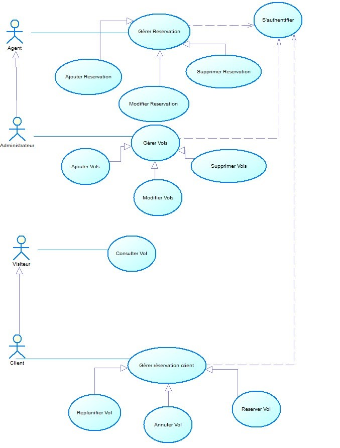
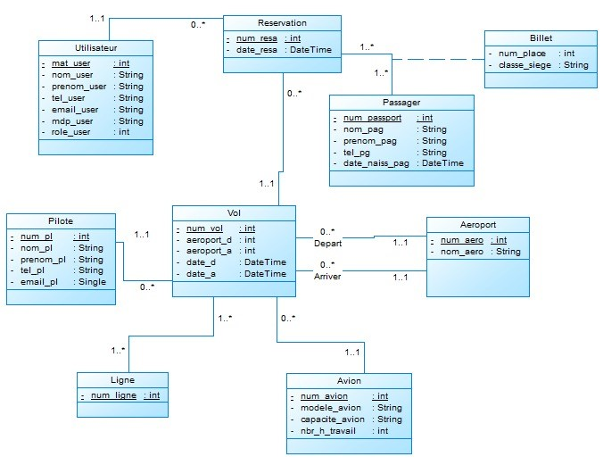

# Flight Management And Reservation
Development of a web application for booking and managing flights.

Tools: ASP.NET,entityFramework et SQL Server 
# Motivation
this project was an PFE project that i had present in my 4th year of my computer engineering diploma final exam.
The goal of this project consists of developing a flight booking and management web application to simulate processing and facilitate management and booking flight using ASP.NET, entityFramework and SQL Server.

# Project's Architecture
## UseCase Diagram

Here we see the use case diagram, as it shows, the user can check the available flights, so far he is only a visitor, After choosing a flight to book, a Login interface is displayed to connect before continuing the reservation process, This is on the customer side,
On the admin side, the administrator has the right to manage flights such as add flights, delete and modify.



## Class Diagram

So, As shown in the following class diagram, the application allows the user who has the role of client in the user class to make a reservation which will make him a "Passenger" identified by his passport number and also generate a ticket for him to print. This reservation will be entered under a defined flight which is also identified by its number. Each flight is assigned to one and only one pilot, one and only one plane also, contains one or more lines (with line we mean the small flights between each two stopovers), and of course a departure airport and another arrival must also be defined.



# Production

For this function I am using the AES encryption algorithm in which I use a symmetric key (identical) for the encryption process.
First, the original text i.e. clear text is converted to bytes, and then for the AES algorithm to perform the encryption, use the derived bytes and symmetric key from it.
Using MemoryStream and CryptoStream, the clear text is encrypted and written to a byte array and finally the byte array is converted to Base64String and returned the final result, i.e. the corresponding ciphertext.
And for decryption there is a method:
The first is to interact with the database to recover the encrypted passwords and decrypt them through decryption function.
The second method is to encrypt the passwords that the user has entered and compare the two text encryptors if they are identical.
``` Ruby
private string Encrypt(string clearText)
        {
            string EncryptionKey = "MAKV2SPBNI99212";
            byte[] clearBytes = Encoding.Unicode.GetBytes(clearText);
            using (Aes encryptor = Aes.Create())
            {
                Rfc2898DeriveBytes pdb = new Rfc2898DeriveBytes(EncryptionKey, new byte[] { 0x49, 0x76, 0x61, 0x6e, 0x20, 0x4d, 0x65, 0x64, 0x76, 0x65, 0x64, 0x65, 0x76 });
                encryptor.Key = pdb.GetBytes(32);
                encryptor.IV = pdb.GetBytes(16);
                using (MemoryStream ms = new MemoryStream())
                {
                    using (CryptoStream cs = new CryptoStream(ms, encryptor.CreateEncryptor(), CryptoStreamMode.Write))
                    {
                        cs.Write(clearBytes, 0, clearBytes.Length);
                        cs.Close();
                    }
                    clearText = Convert.ToBase64String(ms.ToArray());
                }
            }
            return clearText;
        }
        end
```

# Simulation
## Login_Page


## Dashboard Admin


## Booking User


